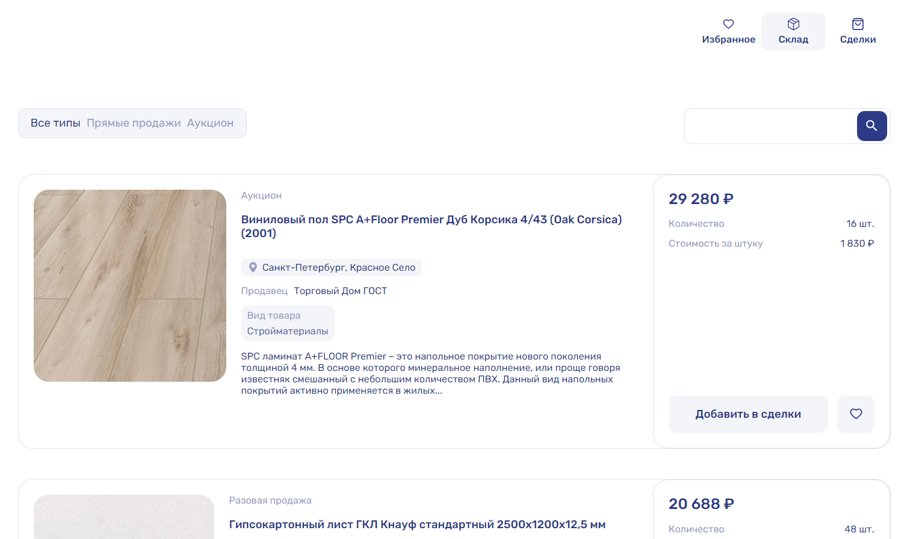

<div align="center">

# Stock

✨ Simple realization of a warehouse with goods ✨

</div>

## About Stock 📰

Stock is a GitHub repository for a simple online store that allows users to manage their inventory of products. Users can add products to their deals section or mark them as favorites, and also remove products from their favorites. The favorites section stores products that users have liked, while the deals section stores products that are available for purchase

Overall, Stock is a user-friendly and customizable project that provides efficient inventory management for online stores, with features such as favorites, deals, and purchase functionality.

</br>
<div align="center">
  
</div>
</br>

### Installation and startup stages
```
npm install
```
```
npm run dev
```

### Additional commands
```
npm run build
```
```
npm run lint
```


### Deployment
This application can be used on Vercel - https://git-search-rho-three.vercel.app/
